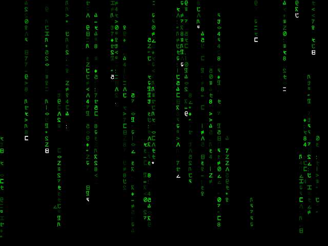



## DX Matrix

### Description

You've seen the rest, now try the best! DX Matrix closely emulates the scrolling code as seen in the movie. To run the program, you need to have installed DirectX 7 (or higher), the VB6 runtime and, for best results, the matrix true type font as supplied. Use P to pause the matrix, and escape to exit. NOTE: DX Matrix II is now available. The most realistic Matrix emulation package yet, featuring 3 simulations from the movie, and realistic sound - visit my WEB site to download it - http://www.dhutchison.freeuk.com
 
### More Info
 

             |
---                |---
**Submitted On**   |2001-01-26 22:15:40
**By**             |[Darren Hutchison](https://github.com/Planet-Source-Code/PSCIndex/blob/master/ByAuthor/darren-hutchison.md)
**Level**          |Intermediate
**User Rating**    |4.7 (161 globes from 34 users)
**Compatibility**  |VB 6\.0
**Category**       |[DirectX](https://github.com/Planet-Source-Code/PSCIndex/blob/master/ByCategory/directx__1-44.md)
**World**          |[Visual Basic](https://github.com/Planet-Source-Code/PSCIndex/blob/master/ByWorld/visual-basic.md)
**Archive File**   |[CODE\_UPLOAD142031262001\.zip](https://github.com/Planet-Source-Code/darren-hutchison-dx-matrix__1-14746/archive/master.zip)

